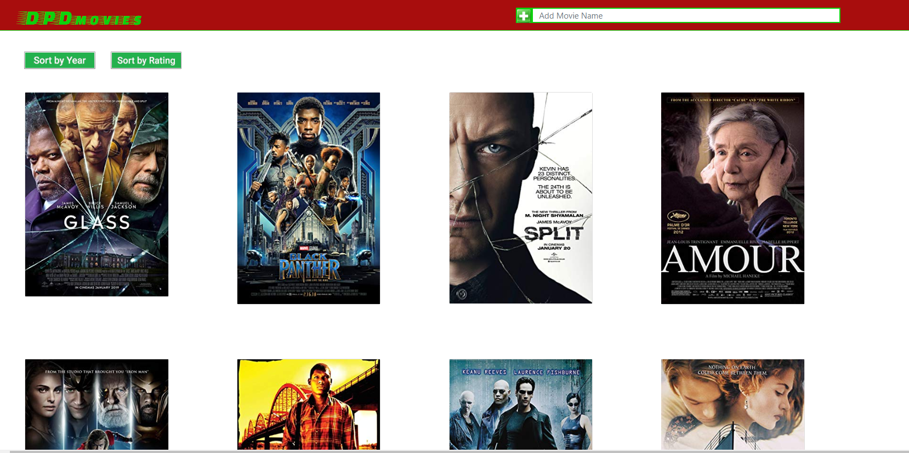

# Project-2

## DPDmovies

Is a Full stack web application that serves as a personal media library to keep track of movies desired to watch and those watched already.

### Home page :point_down:

   

### Modal page view 

   

### Back end view 

   

### Illusration of watched movies from back end view 

   

### Technologies:

-  Node.js (Javascript environment)

-  Express.js (Server framework)

-  dotenv (Secretes)

-  Sequelize (ORM)

-  Handlebars (Templating engine)

-  Heroku (Cloud platform)

-  JawsDB (Heroku database add-on)

-  Bootstrap 4 (Front-end framework)

-  CSS (Styling and Animation)

-  Cards, Modal

-  MySQL (RDBMS)

### Description

-  DPDmovies allows users to add a movie, and then pulls it's info from the omdb API. 

-  It also allows users to watch trailers of searched movies via thier imdbID. 

-  Users will be able to mark movies as watched and also unwatch same movies.

-  Users will also be able to delete any movie of thier choice in the app

-  We applied the CRUD (Create, Read, Update and Delete) method in this application to get it's required result.

-  The modal view animates when user click on a movie poster and it also displays movie info like rotten tomatoes rating etc.
 
### Authors

-  Dennis | Dennis-The14th-web

-  Dorian | DorianBishop

-  Patience | rubbishspitfire